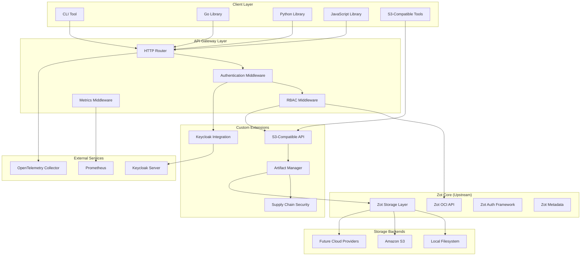
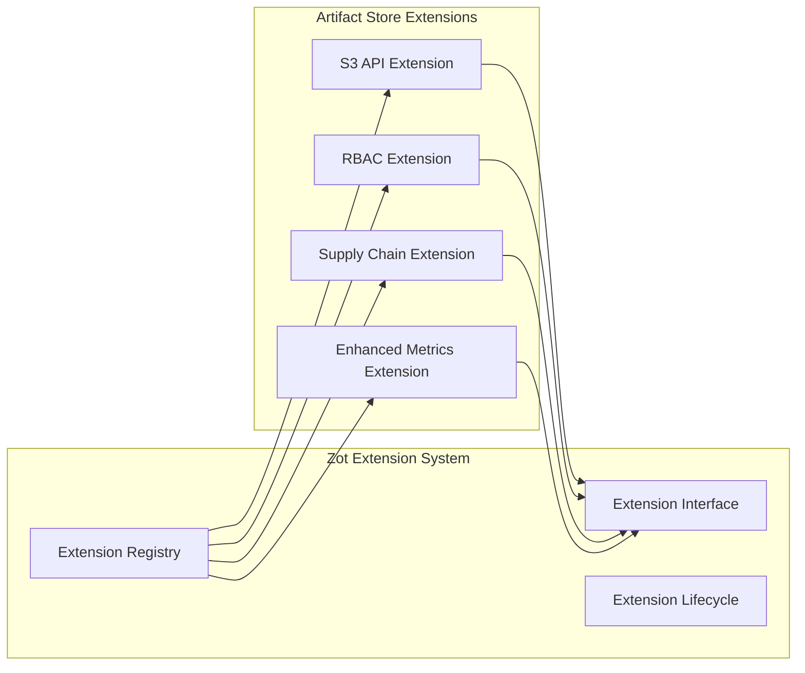
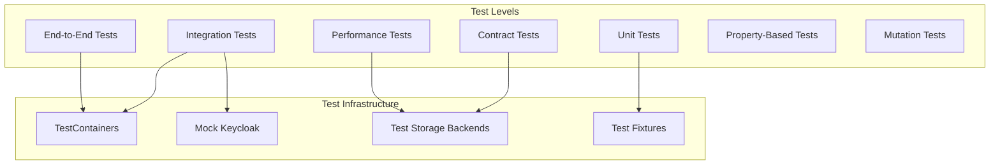

# Design Document: Zot Artifact Store Extension

## Overview

The Zot Artifact Store is an extension of the existing Zot OCI registry that adds enterprise-grade binary artifact storage capabilities while maintaining full compatibility with upstream Zot. The design leverages Zot's existing extension system, storage backends, and infrastructure to minimize custom development while adding comprehensive RBAC, supply chain security features, and S3-compatible APIs for binary artifacts.

The system maintains a clear architectural boundary between upstream Zot functionality and custom extensions, ensuring long-term maintainability and seamless integration of upstream updates.

## Architecture

### High-Level Architecture



### Extension Architecture

The design follows Zot's extension pattern to ensure clean separation and maintainability:



## Components and Interfaces

### 1. S3-Compatible API Extension

**Purpose**: Provides S3-compatible REST API for binary artifact operations

**Key Interfaces**:
```go
type S3APIExtension interface {
    // Bucket Operations
    CreateBucket(ctx context.Context, bucket string, config BucketConfig) error
    DeleteBucket(ctx context.Context, bucket string, recursive bool) error
    ListBuckets(ctx context.Context) ([]BucketInfo, error)
    
    // Object Operations
    PutObject(ctx context.Context, bucket, key string, data io.Reader, metadata ObjectMetadata) error
    GetObject(ctx context.Context, bucket, key string, rangeSpec *RangeSpec) (io.ReadCloser, ObjectMetadata, error)
    DeleteObject(ctx context.Context, bucket, key string) error
    HeadObject(ctx context.Context, bucket, key string) (ObjectMetadata, error)
    ListObjects(ctx context.Context, bucket string, options ListOptions) (ObjectList, error)
    
    // Advanced Operations
    CopyObject(ctx context.Context, srcBucket, srcKey, dstBucket, dstKey string) error
    GeneratePresignedURL(ctx context.Context, bucket, key string, expiry time.Duration) (string, error)
}

type ObjectMetadata struct {
    Size         int64
    ContentType  string
    ETag         string
    LastModified time.Time
    SHA256       string
    CustomMeta   map[string]string
}
```

**Integration Points**:
- Uses Zot's existing storage backend interface
- Leverages Zot's HTTP router and middleware system
- Integrates with custom RBAC extension for authorization

### 2. RBAC Extension with Keycloak Integration

**Purpose**: Provides enterprise-grade role-based access control integrated with Keycloak

**Key Interfaces**:
```go
type RBACExtension interface {
    // Authentication
    AuthenticateToken(ctx context.Context, token string) (*UserContext, error)
    AuthenticateKeycloak(ctx context.Context, keycloakToken string) (*UserContext, error)
    
    // Authorization
    AuthorizeOperation(ctx context.Context, user *UserContext, resource Resource, operation Operation) error
    
    // Policy Management
    SetBucketPolicy(ctx context.Context, bucket string, policy Policy) error
    GetBucketPolicy(ctx context.Context, bucket string) (Policy, error)
    
    // Audit
    LogAccess(ctx context.Context, user *UserContext, resource Resource, operation Operation, result AccessResult)
}

type UserContext struct {
    UserID    string
    Username  string
    Roles     []string
    Groups    []string
    Attributes map[string]interface{}
}

type Resource struct {
    Type   ResourceType // bucket, object, registry
    Bucket string
    Key    string
}
```

**Integration Points**:
- Extends Zot's existing authentication framework
- Integrates with Keycloak via OIDC/OAuth2
- Provides middleware for all API endpoints

### 3. Supply Chain Security Extension

**Purpose**: Implements artifact signing, SBOM support, and attestations

**Key Interfaces**:
```go
type SupplyChainExtension interface {
    // Signing
    SignArtifact(ctx context.Context, artifactRef string, signingKey SigningKey) (*Signature, error)
    VerifySignature(ctx context.Context, artifactRef string, signature *Signature) error
    
    // SBOM Management
    AttachSBOM(ctx context.Context, artifactRef string, sbom *SBOM) error
    GetSBOM(ctx context.Context, artifactRef string) (*SBOM, error)
    
    // Attestations
    AttachAttestation(ctx context.Context, artifactRef string, attestation *Attestation) error
    GetAttestations(ctx context.Context, artifactRef string) ([]*Attestation, error)
    
    // Verification
    VerifySupplyChain(ctx context.Context, artifactRef string) (*VerificationResult, error)
}

type SBOM struct {
    Format    string // SPDX, CycloneDX
    Version   string
    Content   []byte
    Timestamp time.Time
}

type Attestation struct {
    Type      string // build, test, deploy
    Predicate interface{}
    Signature *Signature
    Timestamp time.Time
}
```

**Integration Points**:
- Stores metadata using Zot's metadata system
- Integrates with artifact storage for signature/SBOM storage
- Provides verification APIs for CI/CD integration

### 4. Enhanced Metrics and Observability Extension

**Purpose**: Extends Zot's metrics with artifact-specific monitoring

**Key Interfaces**:
```go
type MetricsExtension interface {
    // Artifact Metrics
    RecordArtifactUpload(ctx context.Context, bucket, artifactType string, size int64, duration time.Duration)
    RecordArtifactDownload(ctx context.Context, bucket, artifactType string, size int64, duration time.Duration)
    
    // Supply Chain Metrics
    RecordSigningOperation(ctx context.Context, operation string, success bool, duration time.Duration)
    RecordVerificationOperation(ctx context.Context, operation string, success bool, duration time.Duration)
    
    // RBAC Metrics
    RecordAuthenticationAttempt(ctx context.Context, method string, success bool)
    RecordAuthorizationCheck(ctx context.Context, resource string, operation string, allowed bool)
}
```

## Data Models

### Artifact Metadata Model

```go
type ArtifactMetadata struct {
    // Core Metadata
    ID           string    `json:"id"`
    Bucket       string    `json:"bucket"`
    Key          string    `json:"key"`
    Size         int64     `json:"size"`
    ContentType  string    `json:"content_type"`
    SHA256       string    `json:"sha256"`
    CreatedAt    time.Time `json:"created_at"`
    UpdatedAt    time.Time `json:"updated_at"`
    
    // Artifact Type Specific
    ArtifactType string                 `json:"artifact_type"` // binary, oci, rpm, helm, sbom
    TypeMetadata map[string]interface{} `json:"type_metadata"`
    
    // Supply Chain Security
    Signatures   []SignatureRef    `json:"signatures,omitempty"`
    SBOMs        []SBOMRef        `json:"sboms,omitempty"`
    Attestations []AttestationRef `json:"attestations,omitempty"`
    
    // Access Control
    Owner       string            `json:"owner"`
    Permissions map[string]string `json:"permissions"`
    
    // Custom Metadata
    Labels      map[string]string `json:"labels"`
    Annotations map[string]string `json:"annotations"`
}
```

### RBAC Policy Model

```go
type Policy struct {
    Version    string      `json:"version"`
    Statements []Statement `json:"statements"`
}

type Statement struct {
    Effect    string   `json:"effect"`    // Allow, Deny
    Principal string   `json:"principal"` // user, role, group
    Actions   []string `json:"actions"`   // s3:GetObject, s3:PutObject, etc.
    Resources []string `json:"resources"` // bucket/*, bucket/prefix/*
    Conditions map[string]interface{} `json:"conditions,omitempty"`
}
```

### Storage Schema

The system uses Zot's existing BoltDB metadata store with additional buckets:

```
BoltDB Buckets:
├── zot_* (existing Zot buckets)
├── artifact_metadata (binary artifact metadata)
├── rbac_policies (bucket and object policies)
├── supply_chain_signatures (artifact signatures)
├── supply_chain_sboms (SBOM metadata)
├── supply_chain_attestations (attestation metadata)
└── audit_logs (access and operation logs)
```

## Error Handling

### Error Classification

```go
type ErrorType string

const (
    ErrorTypeAuthentication ErrorType = "authentication"
    ErrorTypeAuthorization  ErrorType = "authorization"
    ErrorTypeValidation     ErrorType = "validation"
    ErrorTypeStorage        ErrorType = "storage"
    ErrorTypeIntegrity      ErrorType = "integrity"
    ErrorTypeSupplyChain    ErrorType = "supply_chain"
    ErrorTypeInternal       ErrorType = "internal"
)

type ArtifactStoreError struct {
    Type       ErrorType `json:"type"`
    Code       string    `json:"code"`
    Message    string    `json:"message"`
    Details    string    `json:"details,omitempty"`
    Retryable  bool      `json:"retryable"`
    HTTPStatus int       `json:"http_status"`
}
```

### Error Handling Patterns

1. **Authentication Errors**: Return 401 with specific error codes for token validation, Keycloak integration failures
2. **Authorization Errors**: Return 403 with detailed policy violation information
3. **Validation Errors**: Return 400 with field-specific validation messages
4. **Storage Errors**: Return 500/503 with retry guidance for transient failures
5. **Integrity Errors**: Return 422 with checksum mismatch details
6. **Supply Chain Errors**: Return 400/422 with signature/attestation validation details

### Retry and Circuit Breaker Patterns

```go
type RetryConfig struct {
    MaxAttempts     int
    InitialDelay    time.Duration
    MaxDelay        time.Duration
    BackoffFactor   float64
    RetryableErrors []ErrorType
}

type CircuitBreakerConfig struct {
    FailureThreshold int
    RecoveryTimeout  time.Duration
    HalfOpenRequests int
}
```

## Testing Strategy

### Test Architecture



### Test Coverage Requirements

1. **Unit Tests**: 90% code coverage for all custom extension code
2. **Integration Tests**: All API endpoints with comprehensive scenarios
3. **Contract Tests**: All interfaces with upstream Zot components
4. **End-to-End Tests**: Complete user workflows including authentication, upload, download, supply chain features
5. **Performance Tests**: Load and stress testing for concurrent operations
6. **Property-Based Tests**: Critical algorithms and validation logic
7. **Mutation Tests**: Validate test suite effectiveness

### Test Data Management

```go
type TestFixture struct {
    Name        string
    Description string
    Setup       func() error
    Teardown    func() error
    Data        interface{}
}

// Example fixtures
var TestFixtures = []TestFixture{
    {
        Name: "basic_binary_artifacts",
        Description: "Set of binary artifacts for basic operations testing",
        Setup: setupBasicArtifacts,
        Data: BasicArtifactSet{...},
    },
    {
        Name: "rbac_test_users",
        Description: "Test users with various roles and permissions",
        Setup: setupRBACUsers,
        Data: RBACTestUsers{...},
    },
    {
        Name: "supply_chain_artifacts",
        Description: "Signed artifacts with SBOMs and attestations",
        Setup: setupSupplyChainArtifacts,
        Data: SupplyChainTestSet{...},
    },
}
```

### AI-Friendly Test Patterns

1. **Descriptive Test Names**: Use behavior-driven naming conventions
2. **Comprehensive Test Documentation**: Include test purpose, setup, and expected outcomes
3. **Standardized Assertions**: Use consistent assertion patterns across tests
4. **Mock and Stub Patterns**: Provide reusable mock implementations
5. **Test Utilities**: Helper functions for common test operations
6. **Failure Analysis**: Detailed error messages and debugging information

## Implementation Phases

### Phase 1: Foundation (Weeks 1-4)
- Set up Zot fork and extension framework
- Implement basic S3-compatible API structure
- Basic authentication integration
- Core storage operations for binary artifacts

### Phase 2: RBAC Integration (Weeks 5-8)
- Keycloak integration
- Policy engine implementation
- Authorization middleware
- Audit logging

### Phase 3: Supply Chain Security (Weeks 9-12)
- Artifact signing infrastructure
- SBOM support
- Attestation management
- Verification APIs

### Phase 4: Client Libraries (Weeks 13-16)
- Go library implementation
- Python library implementation
- JavaScript library implementation
- CLI tool development

### Phase 5: Advanced Features (Weeks 17-20)
- Enhanced metrics and monitoring
- Performance optimization
- Advanced S3 API features
- CI/CD integration preparation

## Security Considerations

### Authentication Security
- JWT token validation with proper expiration
- Keycloak integration with secure token exchange
- Rate limiting on authentication endpoints
- Secure token storage and transmission

### Authorization Security
- Principle of least privilege
- Fine-grained permission model
- Policy validation and sanitization
- Audit trail for all authorization decisions

### Data Security
- Encryption at rest for sensitive metadata
- TLS encryption for all API communications
- Secure key management for signing operations
- Input validation and sanitization

### Supply Chain Security
- Cryptographic signature verification
- SBOM integrity validation
- Attestation chain verification
- Secure artifact provenance tracking

## Performance Considerations

### Scalability Targets
- Support for 10,000+ concurrent users
- Handle artifacts up to 10GB in size
- Process 1,000+ uploads/downloads per second
- Maintain sub-100ms response times for metadata operations

### Optimization Strategies
- Chunked upload/download for large artifacts
- Metadata caching for frequently accessed artifacts
- Connection pooling for storage backends
- Asynchronous processing for supply chain operations

### Monitoring and Alerting
- Real-time performance metrics
- Resource utilization monitoring
- Error rate tracking
- SLA compliance monitoring

This design provides a comprehensive foundation for implementing the Zot Artifact Store extension while maintaining clean separation from upstream Zot code and ensuring long-term maintainability.