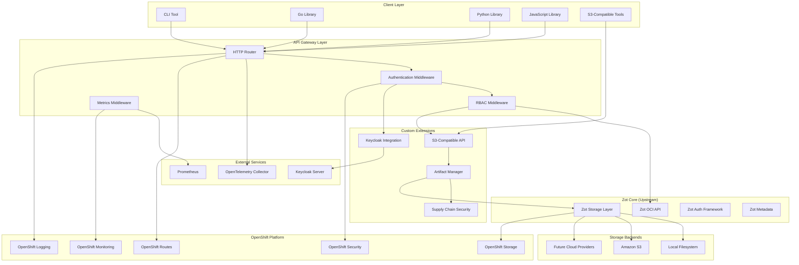
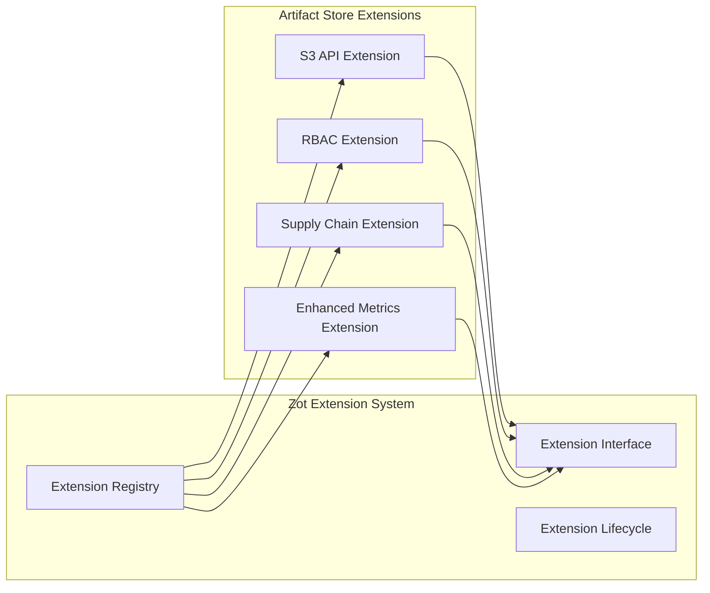
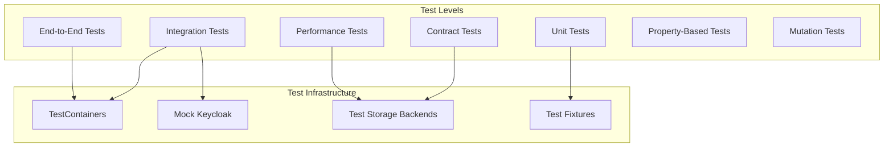
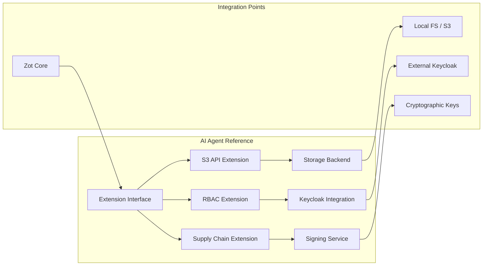

# Design Document: Zot Artifact Store Extension

**Last Updated:** 2025-10-29

## Implementation Status

**IMPORTANT:** This document describes the complete design vision. Not all features are fully implemented.

### What's Implemented ✅
- S3-Compatible API with 13 endpoints (17/17 tests passing)
- RBAC Extension with JWT validation, policy engine, audit logging (7/7 tests passing)
- Supply Chain Extension with signing, SBOM, attestations (11/11 tests passing)
- Storage backends: Filesystem, S3, Azure Blob, Google Cloud Storage (16/16 tests passing)
- Metrics Extension: Prometheus, OpenTelemetry, health checks (14/14 tests passing)
- Client libraries: Go, Python, JavaScript/TypeScript (all tests passing)
- CLI tool with complete command set

### What's Partially Implemented 🟡
- Extension integration (some build failures)
- OpenShift integration (designed but not fully production-validated)

### What's Design-Only ❌
- Kubernetes Operator Go controller (CRD YAML exists, no Go implementation)
- Full CI/CD GitHub Actions integration (workflow exists but not fully tested)
- Complete Tekton pipeline support
- Advanced OpenShift features (some designed but not implemented)

## Overview

The Zot Artifact Store is an extension of the existing Zot OCI registry that adds enterprise-grade binary artifact storage capabilities while maintaining full compatibility with upstream Zot. The design leverages Zot's existing extension system, storage backends, and infrastructure to minimize custom development while adding comprehensive RBAC, supply chain security features, and S3-compatible APIs for binary artifacts.

The system is specifically designed for deployment on Red Hat OpenShift, utilizing Red Hat tooling and technologies throughout the build, deployment, and operational lifecycle. This includes using Podman instead of Docker, OpenShift-native resources, and integration with OpenShift's security, monitoring, and storage capabilities.

The system maintains a clear architectural boundary between upstream Zot functionality and custom extensions, ensuring long-term maintainability and seamless integration of upstream updates.

## Architecture

### High-Level Architecture



### Extension Architecture

The design follows Zot's extension pattern to ensure clean separation and maintainability:



## OpenShift Integration Design

### Container Runtime and Build Strategy

The system is designed to use Red Hat's container ecosystem:

- **Podman Runtime**: All container operations use Podman instead of Docker
- **OpenShift Builds**: Utilize BuildConfig and ImageStream resources for native OpenShift builds
- **Red Hat Base Images**: Use Red Hat Universal Base Images (UBI) as foundation

### OpenShift-Native Resources

```yaml
# DeploymentConfig instead of Kubernetes Deployment
apiVersion: apps.openshift.io/v1
kind: DeploymentConfig
metadata:
  name: zot-artifact-store
spec:
  replicas: 3
  selector:
    app: zot-artifact-store
  template:
    spec:
      containers:
      - name: zot-artifact-store
        image: registry.redhat.io/ubi8/ubi:latest
        securityContext:
          runAsNonRoot: true
          allowPrivilegeEscalation: false

# Route instead of Kubernetes Ingress
apiVersion: route.openshift.io/v1
kind: Route
metadata:
  name: zot-artifact-store
spec:
  host: artifacts.apps.cluster.example.com
  tls:
    termination: edge
  to:
    kind: Service
    name: zot-artifact-store
```

### Security Context Constraints (SCCs)

```yaml
apiVersion: security.openshift.io/v1
kind: SecurityContextConstraints
metadata:
  name: zot-artifact-store-scc
allowHostDirVolumePlugin: false
allowHostIPC: false
allowHostNetwork: false
allowHostPID: false
allowPrivilegedContainer: false
allowedCapabilities: []
defaultAddCapabilities: []
fsGroup:
  type: MustRunAs
  ranges:
  - min: 1000
    max: 2000
runAsUser:
  type: MustRunAsRange
  uidRangeMin: 1000
  uidRangeMax: 2000
```

### OpenShift Storage Integration

```go
type OpenShiftStorageConfig struct {
    // OpenShift Storage Classes
    StorageClass     string `yaml:"storage_class"`
    VolumeMode       string `yaml:"volume_mode"`       // Filesystem, Block
    AccessMode       string `yaml:"access_mode"`       // ReadWriteOnce, ReadWriteMany
    
    // Persistent Volume Claims
    PVCTemplate      PVCTemplate `yaml:"pvc_template"`
    
    // OpenShift-specific storage features
    SnapshotClass    string `yaml:"snapshot_class,omitempty"`
    BackupPolicy     string `yaml:"backup_policy,omitempty"`
}
```

### OpenShift Monitoring Integration

```go
type OpenShiftMetricsExtension interface {
    // OpenShift-specific metrics
    RecordOpenShiftMetrics(ctx context.Context, metrics OpenShiftMetrics)
    
    // Integration with OpenShift monitoring stack
    RegisterWithOpenShiftMonitoring(ctx context.Context) error
    
    // Custom resource metrics
    RecordResourceUsage(ctx context.Context, usage ResourceUsage)
}

type OpenShiftMetrics struct {
    PodMetrics      PodMetrics      `json:"pod_metrics"`
    ServiceMetrics  ServiceMetrics  `json:"service_metrics"`
    RouteMetrics    RouteMetrics    `json:"route_metrics"`
    StorageMetrics  StorageMetrics  `json:"storage_metrics"`
}
```

### CI/CD Integration Design

The system is designed for seamless integration with modern CI/CD platforms, specifically GitHub Actions and Tekton pipelines:

**GitHub Actions Integration**:
```yaml
name: Build and Deploy to OpenShift
on:
  push:
    branches: [main]
  pull_request:
    branches: [main]

jobs:
  build:
    runs-on: ubuntu-latest
    steps:
    - uses: actions/checkout@v4
    
    - name: Set up Podman
      run: |
        sudo apt-get update
        sudo apt-get install -y podman
    
    - name: Build with Podman
      run: |
        podman build -f Containerfile -t zot-artifact-store:latest .
    
    - name: Push to Registry
      run: |
        podman push zot-artifact-store:latest ${{ secrets.REGISTRY_URL }}/zot-artifact-store:latest
    
    - name: Upload Build Artifacts
      uses: ./actions/upload-artifact
      with:
        bucket: build-artifacts
        path: ./dist/
        sign: true
        sbom: ./dist/sbom.json
```

**Tekton Pipeline Compatibility**:
```yaml
apiVersion: tekton.dev/v1beta1
kind: Pipeline
metadata:
  name: zot-artifact-store-pipeline
spec:
  tasks:
  - name: build-and-upload
    taskRef:
      name: zot-artifact-upload
    params:
    - name: bucket
      value: "build-artifacts"
    - name: source-path
      value: "./dist/"
    - name: enable-signing
      value: "true"
```

**API Design for CI/CD Integration**:
- RESTful endpoints compatible with standard CI/CD tools
- Webhook support for build notifications
- Batch operations for efficient artifact management
- Status APIs for pipeline integration

## Components and Interfaces

### 1. S3-Compatible API Extension

**Purpose**: Provides S3-compatible REST API for binary artifact operations with resumable upload support

**Key Interfaces**:
```go
type S3APIExtension interface {
    // Bucket Operations
    CreateBucket(ctx context.Context, bucket string, config BucketConfig) error
    DeleteBucket(ctx context.Context, bucket string, recursive bool) error
    ListBuckets(ctx context.Context) ([]BucketInfo, error)
    
    // Object Operations
    PutObject(ctx context.Context, bucket, key string, data io.Reader, metadata ObjectMetadata) error
    GetObject(ctx context.Context, bucket, key string, rangeSpec *RangeSpec) (io.ReadCloser, ObjectMetadata, error)
    DeleteObject(ctx context.Context, bucket, key string) error
    HeadObject(ctx context.Context, bucket, key string) (ObjectMetadata, error)
    ListObjects(ctx context.Context, bucket string, options ListOptions) (ObjectList, error)
    
    // Advanced Operations
    CopyObject(ctx context.Context, srcBucket, srcKey, dstBucket, dstKey string) error
    GeneratePresignedURL(ctx context.Context, bucket, key string, expiry time.Duration) (string, error)
    
    // Resumable Upload Support (HTTP 206 Partial Content)
    InitiateMultipartUpload(ctx context.Context, bucket, key string, metadata ObjectMetadata) (*MultipartUpload, error)
    UploadPart(ctx context.Context, uploadID string, partNumber int, data io.Reader) (*PartInfo, error)
    CompleteMultipartUpload(ctx context.Context, uploadID string, parts []PartInfo) error
    AbortMultipartUpload(ctx context.Context, uploadID string) error
}

type ObjectMetadata struct {
    Size         int64
    ContentType  string
    ETag         string
    LastModified time.Time
    SHA256       string
    CustomMeta   map[string]string
}

type MultipartUpload struct {
    UploadID string
    Bucket   string
    Key      string
    Created  time.Time
}

type PartInfo struct {
    PartNumber int
    ETag       string
    Size       int64
}
```

**Integration Points**:
- Uses Zot's existing storage backend interface
- Leverages Zot's HTTP router and middleware system
- Integrates with custom RBAC extension for authorization
- Implements HTTP 206 Partial Content for resumable transfers

### 2. RBAC Extension with Keycloak Integration

**Purpose**: Provides enterprise-grade role-based access control integrated with Keycloak

**Key Interfaces**:
```go
type RBACExtension interface {
    // Authentication
    AuthenticateToken(ctx context.Context, token string) (*UserContext, error)
    AuthenticateKeycloak(ctx context.Context, keycloakToken string) (*UserContext, error)
    
    // Authorization
    AuthorizeOperation(ctx context.Context, user *UserContext, resource Resource, operation Operation) error
    
    // Policy Management
    SetBucketPolicy(ctx context.Context, bucket string, policy Policy) error
    GetBucketPolicy(ctx context.Context, bucket string) (Policy, error)
    
    // Audit
    LogAccess(ctx context.Context, user *UserContext, resource Resource, operation Operation, result AccessResult)
}

type UserContext struct {
    UserID    string
    Username  string
    Roles     []string
    Groups    []string
    Attributes map[string]interface{}
}

type Resource struct {
    Type   ResourceType // bucket, object, registry
    Bucket string
    Key    string
}
```

**Integration Points**:
- Extends Zot's existing authentication framework
- Integrates with Keycloak via OIDC/OAuth2
- Provides middleware for all API endpoints

### 3. Supply Chain Security Extension

**Purpose**: Implements artifact signing, SBOM support, and attestations

**Key Interfaces**:
```go
type SupplyChainExtension interface {
    // Signing
    SignArtifact(ctx context.Context, artifactRef string, signingKey SigningKey) (*Signature, error)
    VerifySignature(ctx context.Context, artifactRef string, signature *Signature) error
    
    // SBOM Management
    AttachSBOM(ctx context.Context, artifactRef string, sbom *SBOM) error
    GetSBOM(ctx context.Context, artifactRef string) (*SBOM, error)
    
    // Attestations
    AttachAttestation(ctx context.Context, artifactRef string, attestation *Attestation) error
    GetAttestations(ctx context.Context, artifactRef string) ([]*Attestation, error)
    
    // Verification
    VerifySupplyChain(ctx context.Context, artifactRef string) (*VerificationResult, error)
}

type SBOM struct {
    Format    string // SPDX, CycloneDX
    Version   string
    Content   []byte
    Timestamp time.Time
}

type Attestation struct {
    Type      string // build, test, deploy
    Predicate interface{}
    Signature *Signature
    Timestamp time.Time
}
```

**Integration Points**:
- Stores metadata using Zot's metadata system
- Integrates with artifact storage for signature/SBOM storage
- Provides verification APIs for CI/CD integration

### 4. Enhanced Metrics and Observability Extension

**Purpose**: Extends Zot's metrics with artifact-specific monitoring

**Key Interfaces**:
```go
type MetricsExtension interface {
    // Artifact Metrics
    RecordArtifactUpload(ctx context.Context, bucket, artifactType string, size int64, duration time.Duration)
    RecordArtifactDownload(ctx context.Context, bucket, artifactType string, size int64, duration time.Duration)
    
    // Supply Chain Metrics
    RecordSigningOperation(ctx context.Context, operation string, success bool, duration time.Duration)
    RecordVerificationOperation(ctx context.Context, operation string, success bool, duration time.Duration)
    
    // RBAC Metrics
    RecordAuthenticationAttempt(ctx context.Context, method string, success bool)
    RecordAuthorizationCheck(ctx context.Context, resource string, operation string, allowed bool)
}
```

### 5. Client Libraries Architecture

**Purpose**: Provides consistent programmatic access across Go, Python, and JavaScript with unified authentication and error handling

**Design Rationale**: All client libraries share a common interface design to ensure consistency across languages while leveraging language-specific idioms and best practices.

**Go Client Library**:
```go
type ArtifactStoreClient struct {
    baseURL    string
    httpClient *http.Client
    auth       AuthProvider
}

type ClientConfig struct {
    BaseURL     string
    Timeout     time.Duration
    RetryConfig RetryConfig
    Auth        AuthConfig
}

type AuthConfig struct {
    Type         AuthType // bearer_token, keycloak
    BearerToken  string
    KeycloakURL  string
    ClientID     string
    ClientSecret string
}

// Core operations interface
type ArtifactOperations interface {
    Upload(ctx context.Context, bucket, key string, data io.Reader, opts UploadOptions) error
    Download(ctx context.Context, bucket, key string, opts DownloadOptions) (io.ReadCloser, error)
    List(ctx context.Context, bucket string, opts ListOptions) ([]ArtifactInfo, error)
    Delete(ctx context.Context, bucket, key string) error
}
```

**Python Client Library**:
```python
class ArtifactStoreClient:
    def __init__(self, base_url: str, auth: AuthConfig, **kwargs):
        self.base_url = base_url
        self.auth = auth
        self.session = requests.Session()
        self._configure_session(**kwargs)
    
    async def upload(self, bucket: str, key: str, data: BinaryIO, 
                    metadata: Optional[Dict] = None) -> None:
        """Upload binary artifact with optional metadata"""
        
    async def download(self, bucket: str, key: str, 
                      range_spec: Optional[str] = None) -> AsyncIterator[bytes]:
        """Download binary artifact with optional range support"""
        
    async def list_objects(self, bucket: str, prefix: Optional[str] = None, 
                          limit: Optional[int] = None) -> List[ArtifactInfo]:
        """List objects in bucket with filtering and pagination"""
```

**JavaScript Client Library**:
```javascript
class ArtifactStoreClient {
    constructor(config) {
        this.baseURL = config.baseURL;
        this.auth = config.auth;
        this.httpClient = this._createHttpClient(config);
    }
    
    async upload(bucket, key, data, options = {}) {
        // Upload binary artifact with progress tracking
        // Supports both Node.js streams and browser File objects
    }
    
    async download(bucket, key, options = {}) {
        // Download with streaming support for both environments
        // Returns appropriate stream type for Node.js vs browser
    }
    
    async listObjects(bucket, options = {}) {
        // List objects with filtering and pagination
        // Returns consistent object structure across environments
    }
}
```

**CLI Tool Architecture**:
```go
// Built on Go client library for consistency
type CLIConfig struct {
    ConfigFile   string
    Profile      string
    OutputFormat string // json, yaml, table
    Verbose      bool
}

// Command structure using cobra framework
var rootCmd = &cobra.Command{
    Use:   "zot-artifacts",
    Short: "Zot Artifact Store CLI",
}

var uploadCmd = &cobra.Command{
    Use:   "upload [bucket] [key] [file]",
    Short: "Upload binary artifact",
    Args:  cobra.ExactArgs(3),
    RunE:  runUpload,
}
```

**Unified Error Handling**:
All client libraries implement consistent error handling with structured error responses:
```go
type ClientError struct {
    Type       string `json:"type"`
    Code       string `json:"code"`
    Message    string `json:"message"`
    HTTPStatus int    `json:"http_status"`
    Retryable  bool   `json:"retryable"`
}
```

## Data Models

### Artifact Metadata Model

```go
type ArtifactMetadata struct {
    // Core Metadata
    ID           string    `json:"id"`
    Bucket       string    `json:"bucket"`
    Key          string    `json:"key"`
    Size         int64     `json:"size"`
    ContentType  string    `json:"content_type"`
    SHA256       string    `json:"sha256"`
    CreatedAt    time.Time `json:"created_at"`
    UpdatedAt    time.Time `json:"updated_at"`
    
    // Artifact Type Specific
    ArtifactType string                 `json:"artifact_type"` // binary, oci, rpm, helm, sbom
    TypeMetadata map[string]interface{} `json:"type_metadata"`
    
    // Supply Chain Security
    Signatures   []SignatureRef    `json:"signatures,omitempty"`
    SBOMs        []SBOMRef        `json:"sboms,omitempty"`
    Attestations []AttestationRef `json:"attestations,omitempty"`
    
    // Access Control
    Owner       string            `json:"owner"`
    Permissions map[string]string `json:"permissions"`
    
    // Custom Metadata
    Labels      map[string]string `json:"labels"`
    Annotations map[string]string `json:"annotations"`
}
```

### RBAC Policy Model

```go
type Policy struct {
    Version    string      `json:"version"`
    Statements []Statement `json:"statements"`
}

type Statement struct {
    Effect    string   `json:"effect"`    // Allow, Deny
    Principal string   `json:"principal"` // user, role, group
    Actions   []string `json:"actions"`   // s3:GetObject, s3:PutObject, etc.
    Resources []string `json:"resources"` // bucket/*, bucket/prefix/*
    Conditions map[string]interface{} `json:"conditions,omitempty"`
}
```

### Storage Schema

The system uses Zot's existing BoltDB metadata store with additional buckets:

```
BoltDB Buckets:
├── zot_* (existing Zot buckets)
├── artifact_metadata (binary artifact metadata)
├── rbac_policies (bucket and object policies)
├── supply_chain_signatures (artifact signatures)
├── supply_chain_sboms (SBOM metadata)
├── supply_chain_attestations (attestation metadata)
└── audit_logs (access and operation logs)
```

## Error Handling

### Error Classification

```go
type ErrorType string

const (
    ErrorTypeAuthentication ErrorType = "authentication"
    ErrorTypeAuthorization  ErrorType = "authorization"
    ErrorTypeValidation     ErrorType = "validation"
    ErrorTypeStorage        ErrorType = "storage"
    ErrorTypeIntegrity      ErrorType = "integrity"
    ErrorTypeSupplyChain    ErrorType = "supply_chain"
    ErrorTypeInternal       ErrorType = "internal"
)

type ArtifactStoreError struct {
    Type       ErrorType `json:"type"`
    Code       string    `json:"code"`
    Message    string    `json:"message"`
    Details    string    `json:"details,omitempty"`
    Retryable  bool      `json:"retryable"`
    HTTPStatus int       `json:"http_status"`
}
```

### Error Handling Patterns

1. **Authentication Errors**: Return 401 with specific error codes for token validation, Keycloak integration failures
2. **Authorization Errors**: Return 403 with detailed policy violation information
3. **Validation Errors**: Return 400 with field-specific validation messages
4. **Storage Errors**: Return 500/503 with retry guidance for transient failures
5. **Integrity Errors**: Return 422 with checksum mismatch details
6. **Supply Chain Errors**: Return 400/422 with signature/attestation validation details

### Retry and Circuit Breaker Patterns

```go
type RetryConfig struct {
    MaxAttempts     int
    InitialDelay    time.Duration
    MaxDelay        time.Duration
    BackoffFactor   float64
    RetryableErrors []ErrorType
}

type CircuitBreakerConfig struct {
    FailureThreshold int
    RecoveryTimeout  time.Duration
    HalfOpenRequests int
}
```

## Testing Strategy

### Test Architecture



### Test Coverage Requirements

1. **Unit Tests**: 90% code coverage for all custom extension code
2. **Integration Tests**: All API endpoints with comprehensive scenarios
3. **Contract Tests**: All interfaces with upstream Zot components
4. **End-to-End Tests**: Complete user workflows including authentication, upload, download, supply chain features
5. **Performance Tests**: Load and stress testing for concurrent operations
6. **Property-Based Tests**: Critical algorithms and validation logic
7. **Mutation Tests**: Validate test suite effectiveness

### Test Data Management

```go
type TestFixture struct {
    Name        string
    Description string
    Setup       func() error
    Teardown    func() error
    Data        interface{}
}

// Example fixtures
var TestFixtures = []TestFixture{
    {
        Name: "basic_binary_artifacts",
        Description: "Set of binary artifacts for basic operations testing",
        Setup: setupBasicArtifacts,
        Data: BasicArtifactSet{...},
    },
    {
        Name: "rbac_test_users",
        Description: "Test users with various roles and permissions",
        Setup: setupRBACUsers,
        Data: RBACTestUsers{...},
    },
    {
        Name: "supply_chain_artifacts",
        Description: "Signed artifacts with SBOMs and attestations",
        Setup: setupSupplyChainArtifacts,
        Data: SupplyChainTestSet{...},
    },
}
```

### Test-Driven Development (TDD) Strategy

The system implements comprehensive TDD practices to ensure code correctness and AI agent compatibility:

**TDD Workflow**:
1. **Red Phase**: Write failing tests before implementation
2. **Green Phase**: Write minimal code to make tests pass
3. **Refactor Phase**: Improve code while maintaining test coverage

**AI-Friendly Test Patterns**:
1. **Descriptive Test Names**: Use behavior-driven naming conventions (Given_When_Then format)
2. **Comprehensive Test Documentation**: Include test purpose, setup, and expected outcomes with structured comments
3. **Standardized Assertions**: Use consistent assertion patterns across tests with clear error messages
4. **Mock and Stub Patterns**: Provide reusable mock implementations with well-defined interfaces
5. **Test Utilities**: Helper functions for common test operations with clear documentation
6. **Failure Analysis**: Detailed error messages and debugging information for AI agent troubleshooting

**Test Coverage and Quality Assurance**:
```go
// Example of AI-friendly test structure
func TestS3APIExtension_PutObject_WithValidInput_ShouldStoreArtifactSuccessfully(t *testing.T) {
    // Given: A valid S3 API extension with mock storage backend
    mockStorage := &MockStorageBackend{}
    s3API := NewS3APIExtension(mockStorage)
    
    // When: Uploading a binary artifact with valid metadata
    metadata := ObjectMetadata{
        ContentType: "application/octet-stream",
        SHA256:      "expected-hash",
    }
    err := s3API.PutObject(ctx, "test-bucket", "test-key", reader, metadata)
    
    // Then: The artifact should be stored successfully with integrity verification
    assert.NoError(t, err, "PutObject should succeed with valid input")
    assert.True(t, mockStorage.WasCalledWith("test-bucket", "test-key"))
    assert.Equal(t, "expected-hash", mockStorage.StoredMetadata.SHA256)
}
```

**Automated Test Execution and Reporting**:
- Continuous test execution with detailed reporting for AI agent consumption
- Test result parsing and failure analysis automation
- Performance benchmarking with trend analysis
- Mutation testing to validate test suite effectiveness

## Implementation Phases

### Phase 1: Foundation and Dual Deployment Setup (Weeks 1-4)
- Set up Zot fork and extension framework
- Configure Podman-based build system with Containerfile
- Create container-based deployment configuration for development/testing
- Design Custom Resource Definition (CRD) for operator-based deployment
- Implement basic S3-compatible API structure
- Basic authentication integration
- Core storage operations for binary artifacts

### Phase 2: RBAC Integration and OpenShift Security (Weeks 5-8)
- Keycloak integration
- Policy engine implementation
- Authorization middleware
- Security Context Constraints (SCCs) configuration
- OpenShift Pod Security Standards integration
- Audit logging with OpenShift logging integration

### Phase 3: Supply Chain Security (Weeks 9-12)
- Artifact signing infrastructure
- SBOM support
- Attestation management
- Verification APIs
- Integration with OpenShift security scanning

### Phase 4: Client Libraries and Kubernetes Operator (Weeks 13-16)
- Go library implementation
- Python library implementation
- JavaScript library implementation
- CLI tool development
- Kubernetes operator development for OpenShift deployment
- GitHub Workflows for CI/CD integration

### Phase 5: Advanced Features and OpenShift Optimization (Weeks 17-20)
- Enhanced metrics with OpenShift monitoring integration
- Performance optimization for OpenShift environment
- Advanced S3 API features
- OpenShift-native health checks and readiness probes
- CI/CD integration with GitHub Workflows

## Security Considerations

### Authentication Security
- JWT token validation with proper expiration
- Keycloak integration with secure token exchange
- Rate limiting on authentication endpoints
- Secure token storage and transmission

### Authorization Security
- Principle of least privilege
- Fine-grained permission model
- Policy validation and sanitization
- Audit trail for all authorization decisions

### Data Security
- Encryption at rest for sensitive metadata
- TLS encryption for all API communications
- Secure key management for signing operations
- Input validation and sanitization

### Supply Chain Security
- Cryptographic signature verification
- SBOM integrity validation
- Attestation chain verification
- Secure artifact provenance tracking

## Performance Considerations

### Scalability Targets
- Support for 10,000+ concurrent users
- Handle artifacts up to 10GB in size
- Process 1,000+ uploads/downloads per second
- Maintain sub-100ms response times for metadata operations

### Optimization Strategies
- Chunked upload/download for large artifacts
- Metadata caching for frequently accessed artifacts
- Connection pooling for storage backends
- Asynchronous processing for supply chain operations

### Monitoring and Alerting
- Real-time performance metrics
- Resource utilization monitoring
- Error rate tracking
- SLA compliance monitoring

## Deployment Strategy

**Design Rationale**: The system supports two deployment modes to accommodate different use cases: standalone container deployment for development and testing, and operator-managed deployment for production OpenShift environments.

### Container-Based Deployment (Development/Testing)

**Purpose**: Provides simple, lightweight deployment for local development, testing, and simple installations.

**Container Configuration**:
```yaml
# docker-compose.yml or podman-compose.yml
version: '3.8'
services:
  zot-artifact-store:
    image: zot-artifact-store:latest
    ports:
      - "8080:8080"
      - "8443:8443"
    environment:
      - ZOT_CONFIG_FILE=/etc/zot/config.yaml
      - ZOT_LOG_LEVEL=info
    volumes:
      - ./config.yaml:/etc/zot/config.yaml:ro
      - ./data:/var/lib/zot:rw
      - ./certs:/etc/ssl/certs:ro
    restart: unless-stopped
```

**Simple Configuration Example**:
```yaml
# config.yaml for container deployment
http:
  address: "0.0.0.0"
  port: "8080"
  tls:
    cert: "/etc/ssl/certs/server.crt"
    key: "/etc/ssl/certs/server.key"

storage:
  rootDirectory: "/var/lib/zot"
  gc: true
  gcDelay: "1h"

extensions:
  s3:
    enable: true
    endpoint: "/s3"
  
  rbac:
    enable: false  # Simplified for development
  
  supply-chain:
    enable: false  # Simplified for development

log:
  level: "info"
  output: "/dev/stdout"
```

**Container Startup Command**:
```bash
# Using Podman (preferred for Red Hat ecosystem)
podman run -d \
  --name zot-artifact-store \
  -p 8080:8080 \
  -v ./config.yaml:/etc/zot/config.yaml:ro \
  -v ./data:/var/lib/zot:rw \
  zot-artifact-store:latest

# Using Docker (alternative)
docker run -d \
  --name zot-artifact-store \
  -p 8080:8080 \
  -v ./config.yaml:/etc/zot/config.yaml:ro \
  -v ./data:/var/lib/zot:rw \
  zot-artifact-store:latest
```

### Kubernetes Operator-Based Deployment (Production OpenShift)

**Purpose**: Provides enterprise-grade deployment management with full OpenShift integration and lifecycle management.

**Custom Resource Definition (CRD)**:
```yaml
apiVersion: apiextensions.k8s.io/v1
kind: CustomResourceDefinition
metadata:
  name: zotartifactstores.artifacts.zotregistry.io
spec:
  group: artifacts.zotregistry.io
  versions:
  - name: v1
    served: true
    storage: true
    schema:
      openAPIV3Schema:
        type: object
        properties:
          spec:
            type: object
            properties:
              # Core Configuration
              image:
                type: string
                description: "Container image for Zot Artifact Store"
              replicas:
                type: integer
                minimum: 1
                default: 3
              
              # Storage Configuration
              storage:
                type: object
                properties:
                  type:
                    type: string
                    enum: ["filesystem", "s3"]
                  config:
                    type: object
                    description: "Storage backend specific configuration"
              
              # RBAC Configuration
              rbac:
                type: object
                properties:
                  enabled:
                    type: boolean
                    default: true
                  keycloak:
                    type: object
                    properties:
                      url:
                        type: string
                      realm:
                        type: string
                      clientId:
                        type: string
              
              # Supply Chain Security
              supplyChain:
                type: object
                properties:
                  signing:
                    type: object
                    properties:
                      enabled:
                        type: boolean
                        default: false
                      keyProvider:
                        type: string
                        enum: ["vault", "k8s-secret"]
              
              # OpenShift-specific settings
              openshift:
                type: object
                properties:
                  route:
                    type: object
                    properties:
                      enabled:
                        type: boolean
                        default: true
                      host:
                        type: string
                      tls:
                        type: object
                        properties:
                          termination:
                            type: string
                            enum: ["edge", "passthrough", "reencrypt"]
                            default: "edge"
                  scc:
                    type: object
                    properties:
                      create:
                        type: boolean
                        default: true
                      name:
                        type: string
                        default: "zot-artifact-store-scc"
          status:
            type: object
            properties:
              phase:
                type: string
                enum: ["Pending", "Running", "Failed"]
              conditions:
                type: array
                items:
                  type: object
                  properties:
                    type:
                      type: string
                    status:
                      type: string
                    reason:
                      type: string
                    message:
                      type: string
  scope: Namespaced
  names:
    plural: zotartifactstores
    singular: zotartifactstore
    kind: ZotArtifactStore
```

**Single Configuration File Example**:
```yaml
apiVersion: artifacts.zotregistry.io/v1
kind: ZotArtifactStore
metadata:
  name: production-artifact-store
  namespace: zot-system
spec:
  image: "registry.redhat.io/zot-artifact-store:v1.0.0"
  replicas: 3
  
  storage:
    type: "s3"
    config:
      endpoint: "https://s3.amazonaws.com"
      bucket: "production-artifacts"
      region: "us-east-1"
      credentials:
        secretRef:
          name: "s3-credentials"
  
  rbac:
    enabled: true
    keycloak:
      url: "https://keycloak.company.com"
      realm: "production"
      clientId: "zot-artifact-store"
      clientSecret:
        secretRef:
          name: "keycloak-client-secret"
          key: "client-secret"
  
  supplyChain:
    signing:
      enabled: true
      keyProvider: "vault"
      vaultConfig:
        address: "https://vault.company.com"
        path: "secret/signing-keys"
  
  openshift:
    route:
      enabled: true
      host: "artifacts.apps.cluster.company.com"
      tls:
        termination: "edge"
    scc:
      create: true
      name: "zot-artifact-store-scc"
    
    monitoring:
      enabled: true
      serviceMonitor:
        enabled: true
      prometheusRule:
        enabled: true
```

**Operator Responsibilities**:
1. **Resource Creation**: Creates all OpenShift-specific resources (DeploymentConfig, Service, Route, SCC)
2. **Configuration Management**: Translates single YAML configuration into appropriate OpenShift resources
3. **Lifecycle Management**: Handles updates, scaling, and health monitoring
4. **Security Management**: Manages Security Context Constraints and Pod Security Standards
5. **Storage Management**: Configures persistent volumes and storage classes
6. **Monitoring Integration**: Sets up ServiceMonitor and PrometheusRule resources
7. **Certificate Management**: Handles TLS certificate provisioning and rotation

**Operator Architecture**:
```go
type ZotArtifactStoreReconciler struct {
    client.Client
    Scheme *runtime.Scheme
    Log    logr.Logger
}

func (r *ZotArtifactStoreReconciler) Reconcile(ctx context.Context, req ctrl.Request) (ctrl.Result, error) {
    // Fetch the ZotArtifactStore instance
    var artifactStore artifactsv1.ZotArtifactStore
    if err := r.Get(ctx, req.NamespacedName, &artifactStore); err != nil {
        return ctrl.Result{}, client.IgnoreNotFound(err)
    }
    
    // Reconcile all OpenShift resources
    if err := r.reconcileDeploymentConfig(ctx, &artifactStore); err != nil {
        return ctrl.Result{}, err
    }
    
    if err := r.reconcileService(ctx, &artifactStore); err != nil {
        return ctrl.Result{}, err
    }
    
    if err := r.reconcileRoute(ctx, &artifactStore); err != nil {
        return ctrl.Result{}, err
    }
    
    if err := r.reconcileSecurityContextConstraints(ctx, &artifactStore); err != nil {
        return ctrl.Result{}, err
    }
    
    if err := r.reconcileMonitoring(ctx, &artifactStore); err != nil {
        return ctrl.Result{}, err
    }
    
    return ctrl.Result{}, nil
}
```

### Configuration Compatibility

**Design Rationale**: Both deployment methods share a common configuration core to ensure consistency and ease of migration between development and production environments.

**Configuration Translation**:
```go
// ConfigTranslator converts between deployment formats
type ConfigTranslator struct {
    logger logr.Logger
}

// TranslateToZotConfig converts CRD spec to Zot configuration
func (t *ConfigTranslator) TranslateToZotConfig(spec *artifactsv1.ZotArtifactStoreSpec) (*ZotConfig, error) {
    config := &ZotConfig{
        HTTP: HTTPConfig{
            Address: "0.0.0.0",
            Port:    "8080",
        },
        Storage: StorageConfig{
            RootDirectory: "/var/lib/zot",
            GC:           true,
            GCDelay:      "1h",
        },
        Extensions: ExtensionsConfig{},
    }
    
    // Translate storage configuration
    if spec.Storage != nil {
        switch spec.Storage.Type {
        case "filesystem":
            config.Storage.RootDirectory = spec.Storage.Config["rootDirectory"].(string)
        case "s3":
            config.Storage.S3 = &S3Config{
                Endpoint: spec.Storage.Config["endpoint"].(string),
                Bucket:   spec.Storage.Config["bucket"].(string),
                Region:   spec.Storage.Config["region"].(string),
            }
        }
    }
    
    // Translate extension configurations
    if spec.RBAC != nil && spec.RBAC.Enabled {
        config.Extensions.RBAC = &RBACConfig{
            Enable: true,
            Keycloak: &KeycloakConfig{
                URL:      spec.RBAC.Keycloak.URL,
                Realm:    spec.RBAC.Keycloak.Realm,
                ClientID: spec.RBAC.Keycloak.ClientID,
            },
        }
    }
    
    return config, nil
}
```

**Migration Path**:
- Development configurations can be easily converted to CRD format
- Common configuration validation ensures compatibility
- Environment-specific overrides handled appropriately

### OpenShift-Specific Health Checks

```go
type OpenShiftHealthCheck struct {
    // OpenShift-specific readiness checks
    CheckStorageAccess() error
    CheckKeycloakConnectivity() error
    CheckOpenShiftAPIAccess() error
    CheckSecurityConstraints() error
}

// Health endpoint optimized for OpenShift
func (h *OpenShiftHealthCheck) ReadinessProbe(w http.ResponseWriter, r *http.Request) {
    checks := []func() error{
        h.CheckStorageAccess,
        h.CheckKeycloakConnectivity,
        h.CheckOpenShiftAPIAccess,
        h.CheckSecurityConstraints,
    }
    
    for _, check := range checks {
        if err := check(); err != nil {
            http.Error(w, err.Error(), http.StatusServiceUnavailable)
            return
        }
    }
    
    w.WriteHeader(http.StatusOK)
    w.Write([]byte("Ready"))
}
```

### OpenShift Monitoring and Alerting

```yaml
apiVersion: monitoring.coreos.com/v1
kind: ServiceMonitor
metadata:
  name: zot-artifact-store
spec:
  selector:
    matchLabels:
      app: zot-artifact-store
  endpoints:
  - port: metrics
    path: /metrics
    interval: 30s

---
apiVersion: monitoring.coreos.com/v1
kind: PrometheusRule
metadata:
  name: zot-artifact-store-alerts
spec:
  groups:
  - name: zot-artifact-store
    rules:
    - alert: ZotArtifactStoreDown
      expr: up{job="zot-artifact-store"} == 0
      for: 5m
      labels:
        severity: critical
      annotations:
        summary: "Zot Artifact Store is down"
```

## AI-Friendly Documentation Strategy

**Purpose**: Ensure optimal AI agent consumption and code generation throughout the project lifecycle

**Design Rationale**: The documentation strategy is specifically designed to enable AI coding assistants to effectively understand, generate, maintain, and debug code by providing structured, machine-readable information with explicit relationships and patterns.

### Structured Documentation Patterns

**API Specifications**:
```yaml
# OpenAPI 3.0 specification for all REST endpoints
openapi: 3.0.0
info:
  title: Zot Artifact Store API
  version: 1.0.0
paths:
  /v1/buckets/{bucket}/objects/{key}:
    put:
      summary: Upload binary artifact
      parameters:
        - name: bucket
          in: path
          required: true
          schema:
            type: string
            pattern: '^[a-z0-9][a-z0-9-]*[a-z0-9]$'
      requestBody:
        content:
          application/octet-stream:
            schema:
              type: string
              format: binary
      responses:
        '200':
          description: Artifact uploaded successfully
          content:
            application/json:
              schema:
                $ref: '#/components/schemas/ArtifactMetadata'
```

**Interface Documentation**:
```go
// ExtensionInterface defines the contract for all Zot Artifact Store extensions
// AI Agent Usage: Use this interface as the base for implementing new extensions
// Integration Points: All extensions must implement this interface to integrate with Zot's extension system
// Error Handling: All methods should return structured errors using ArtifactStoreError type
type ExtensionInterface interface {
    // Initialize sets up the extension with provided configuration
    // Parameters:
    //   - ctx: Request context for cancellation and timeouts
    //   - config: Extension-specific configuration object
    // Returns:
    //   - error: Initialization error or nil on success
    // AI Agent Note: Always validate configuration before proceeding with initialization
    Initialize(ctx context.Context, config interface{}) error
    
    // Name returns the unique identifier for this extension
    // Returns: String identifier used for extension registry
    // AI Agent Note: Use kebab-case naming convention (e.g., "s3-api", "rbac-keycloak")
    Name() string
}
```

**Component Relationship Documentation**:


### Configuration Documentation

**Machine-Readable Configuration Schema**:
```json
{
  "$schema": "http://json-schema.org/draft-07/schema#",
  "title": "Zot Artifact Store Configuration",
  "type": "object",
  "properties": {
    "extensions": {
      "type": "object",
      "properties": {
        "s3-api": {
          "$ref": "#/definitions/S3APIConfig"
        },
        "rbac": {
          "$ref": "#/definitions/RBACConfig"
        }
      }
    }
  },
  "definitions": {
    "S3APIConfig": {
      "type": "object",
      "properties": {
        "enabled": {
          "type": "boolean",
          "description": "Enable S3-compatible API extension"
        },
        "endpoint": {
          "type": "string",
          "pattern": "^/[a-zA-Z0-9/_-]*$",
          "description": "API endpoint prefix for S3 operations"
        }
      },
      "required": ["enabled"]
    }
  }
}
```

### Error Handling Documentation

**Structured Error Reference**:
```go
// ErrorCatalog provides comprehensive error documentation for AI agents
var ErrorCatalog = map[string]ErrorInfo{
    "AUTH_TOKEN_INVALID": {
        Type:        ErrorTypeAuthentication,
        HTTPStatus:  401,
        Description: "Bearer token is invalid or expired",
        Causes: []string{
            "Token signature verification failed",
            "Token expiration time exceeded",
            "Token issuer not recognized",
        },
        Resolution: []string{
            "Obtain a new token from the authentication provider",
            "Verify token format matches expected JWT structure",
            "Check system clock synchronization",
        },
        AIAgentNote: "Always check token expiration before making API calls",
    },
}
```

### Testing Documentation for AI Agents

**Test Pattern Templates**:
```go
// TestTemplate provides standardized test structure for AI agents
type TestTemplate struct {
    Name        string
    Description string
    Pattern     TestPattern
    Example     string
}

var TestTemplates = []TestTemplate{
    {
        Name:        "API_Endpoint_Test",
        Description: "Standard pattern for testing REST API endpoints",
        Pattern:     TestPatternGivenWhenThen,
        Example: `
func TestS3API_PutObject_WithValidInput_ShouldReturnSuccess(t *testing.T) {
    // Given: A configured S3 API extension with mock storage
    mockStorage := &MockStorage{}
    s3API := NewS3APIExtension(mockStorage)
    
    // When: Uploading a valid binary artifact
    err := s3API.PutObject(ctx, "bucket", "key", reader, metadata)
    
    // Then: The operation should succeed
    assert.NoError(t, err)
    assert.True(t, mockStorage.WasCalledWith("bucket", "key"))
}`,
    },
}
```

This design provides a comprehensive foundation for implementing the Zot Artifact Store extension while maintaining clean separation from upstream Zot code, ensuring long-term maintainability, optimizing for Red Hat OpenShift deployment and operations, and enabling effective AI-assisted development throughout the project lifecycle.